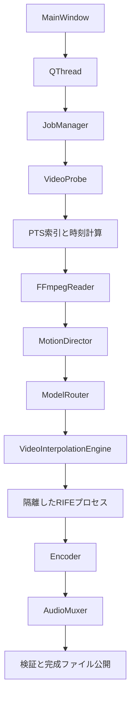

# AnimeCinemaVFI v0.1系の設計

目的は Original Motion Preservation。v0.1 は SDR 8bit の安全な処理基盤を作り、
作画の意図や実効コマ打ちを理解したと表示しない。120fps は品質の保証ではない。

## 境界

UIにtorch/FFmpeg実装を持ち込まない。解析、GPU照会、ジョブはワーカーで行う。
外部プロセスはshellなしの引数配列で起動し、stderrを並行排出する。
RIFEは別プロセスでロードし、異常終了・OOMはジョブエラーとしてGUIへ戻す。
一時停止は処理の安全な境界で行う。キャンセルは停止待ちを解除し外部プロセスを終了する。

## 時間・メモリ

fps/timebase/PTSはFractionで計算。生成する時刻は `n / output_fps`。
元PTSと一致した時刻では元フレームを使う。CFRの出力格子に乗らない元PTSの
完全な保持は数学的にできない（例: 23.976→120、24→60）。120000/1001も指定可能。
浮動小数への変換はモデルのtimestepとFFmpegへ秒数を渡す境界だけに限定する。

ffprobeで全動画のタイムスタンプをSQLiteに索引化し、非単調PTS・VFRを確認する。
動画長に比例して画像をメモリへ蓄積しない。CPUに保持する入力画像は原則2枚。
長尺プレビューの開始前デコードはv0.1では正確さを優先し、シーク高速化は後続課題。

シーン切り替わりでは次の元PTSまで前フレームを保持。カットを跨ぐ補間は禁止。
音声は元ビデオの起点とプレビュー開始分だけPTSを移動し、全音声を明示mapする。
MKVを既定にして音声・字幕・添付ファイルのcopyを優先。MP4に入らないトラックは
処理前エラーとし、音声AAC変換／字幕除外は明示設定にする。

## 色

FFprobeの色タグ・bit depth・side_dataを保持する型を用意する。
v0.1はHDR/BT.2020/10bit以上を処理前に拒否し、黙ってSDRにしない。
8bit SDRのRGB/YUV変換と再エンコードは非可逆。色タグとSARを出力へ伝える。

## モデル

Practical-RIFE 4.25を初期Registry候補とする（2026-09-09公式README確認）。
公式配布のPythonファイルとflownet.pklを持つtrain_logをユーザーが配置する。
モデルコード・重みはアプリに同梱しない。信頼する配布元のコードだけを登録する。
version/path/capabilities/content/VRAM/license/provenanceをRegistryに集約する。
推論は任意timestep対応のModel.inferenceをアダプタ経由で呼ぶ。

## 拡張

- v0.2: MotionDirectorの判断にコマ打ち・静止・カメラ情報を追加。
- v0.3: ModelRouterが区間単位でエンジンを選択。
- v0.4: ArtifactInspector + RetryPlan + SegmentKey。区間再処理の契約のみ。
- v0.5: SemanticAnalyzerの領域情報をFrameContextに追加可能。
- v0.6: QualityEngineの前後処理。Original Preservationの意味を別途定義。
- v0.7: HDREngine。FrameFormatのdtype/transfer/primariesの契約を拡張。
- v1.0: これらを設定するAutoPlanner。v0.1にはAI Autoボタンを置かない。

## 納品時のゲート

ruff、mypy、pytest。人工映像でFFmpegの実際のdecode/encode/muxを検証する。
RIFE実モデル・CUDA・Windowsの検証は、スタブテストと別に結果を明記する。

## v0.1.1で確定した境界

| 契約 | 内容 | 将来の主な利用先 |
|---|---|---|
| `video/frame.py: VideoFrame` | 読取専用HWC配列、Fractionのsource-relative timestamp、FrameFormat。保持フレームは画素コピーせずretimestamp | v0.5〜v0.7 |
| `FrameFormat` | dtype / bit_depth / channels / pixel_format / primaries / transfer / matrix / range | HDR/高精度パイプライン |
| `EngineCapabilities` | pixel formats、dtype、depth、matrix/range、HDR/wide gamut、timestep/batch対応 | v0.3 ModelRouter |
| `ColorEncodingOptions` | 意図的なSDR変換後の期待値、SAR、内部RGB形式とFFmpeg filter | v0.7 Color Engine |
| `EncoderColorPolicy` | 共通color flagsからx264/x265/NVENCのVUI指定へ変換 | encoder追加 |
| `OutputValidator` | 変換後の期待値と実出力を比較。既知値の喪失は公開前エラー | HDRを含む将来の期待値検査 |
| `PairRenderer` | 最大32時刻を計画、カット保護、ModelRouter別に連続する要求をまとめる | v0.2 MotionDirector |
| `interpolate_many` | pair + Sequence[Fraction] → Iterator[VideoFrame]。入力順で逐次出力。単一時刻APIも維持 | Multi VFI |
| `TensorPairCache` | 新pair/scale/OOM時にGPU tensorを再構築。通常は再利用、OOM時のみempty_cache | GPUの寿命・効率 |
| `OutputFPS` | fixed/sourceを区別し、source×整数倍率をFractionで解決 | 原画タイミング保護 |

RGBのmatrixはgbr、rangeはfullとして実際の内部表現を記録する。元のYUV行列はVideoInfoに残し、
再エンコード時にColorEncodingOptionsを使う。タグのみを付け替えてHDR化することはない。
現行SDR policyとRIFE capabilityは8bit SDR以外を拒否する。将来型を扱えることと
実装済みの対応範囲を区別する。

IPCはpairを一度送信し、`infer_many`で最大32個のtimestepとscaleを指定する。workerは各結果を
index付き応答＋RGB bytesで順に送る。途中OOMはリクエストを打ち切り、hostは送信済みprefixを
二重生成せず残りの時刻だけを再要求する。キャンセルではプロセス全体を終了する。
`interpolate_many`は完全に消費するか、ジョブ破棄時にengineをcloseする契約。

元フレームの画素はVFIへ通さないが、decode/色変換/encodeの非可逆性は残る。
整数倍率は公称CFR格子を正確に合わせる基盤であり、元PTSのコンテナ丸めやVFRを消すものではない。
